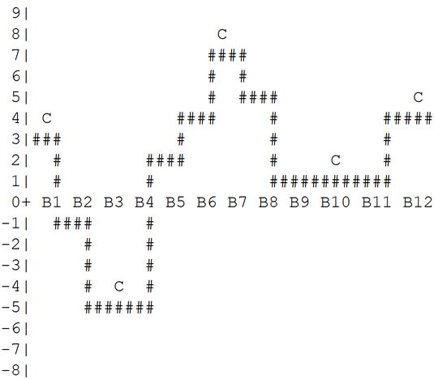

# Castle Builder

Please create a function that will count how many castle that you can build. It has 1 parameter which is an array of numbers as the land height per 1 block length.

## Details:

```bash
F(x)

x = [n], when n is an Integer (-2,147,483,648 to 2,147,483,647)
```

## Additional rules:

- You only can build a castle on a **hill** or a **valley.**
- **Hill** contains block(s) with the height is taller than the neighbors blocks.
- **Valley** contains block(s) with the height is shorter than the neighbors blocks.
- Incomplete **hill or valley** at the first and the last block, still can be used to build a castle (considered as hill or valley)
- Your function just need to count, no need to draw.

## Sample input:

```bash
x = [3, -1, -5, -5, 2, 4, 7, 5, 1, 1, 1, 4]
```

## Illustration based on the input (C is the castle position):



## Sample output (based on sample input):

```bash
5
```
